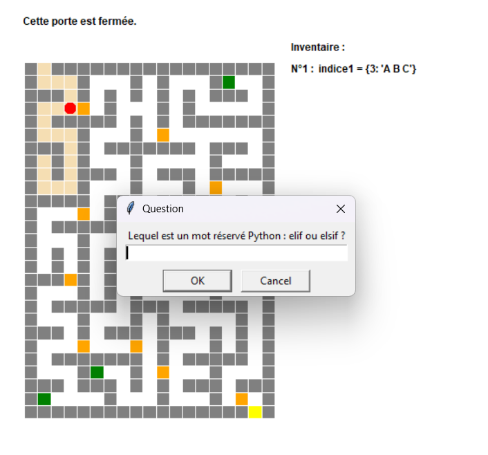

# Castle Maze Game 

A simple interactive maze game built using Python's **Turtle** module. Navigate through the castle, collect objects, open doors by answering questions, and reach the goal!  

---

##  Features

- Maze displayed with **Turtle graphics**.
- Collect objects and track them in your **inventory**.
- Open doors by answering questions correctly.
- Dynamic rendering of the maze and character movements.
- Configurable colors and starting positions via `CONFIGS.py`.

---

##  Game Interface

  
*The Turtle graphics window where the maze and character are displayed.*

---

##  Files

- `main.py` – main Python script (the game logic).  
- `CONFIGS.py` – configuration file (colors, positions, display points, etc.).  
- `plan_chateau.txt` – text file representing the castle maze layout.  
- `dico_objets.txt` – dictionary of objects in the maze.  
- `dico_portes.txt` – dictionary of doors and questions.  

---

##  Requirements

- Python 3.x
- `turtle` module (standard with Python)
- Your terminal or IDE must support Turtle graphics.

---

##  How to Run

1. Clone this repository or download the files.
2. Make sure all files (`main.py`, `CONFIGS.py`, `plan_chateau.txt`, etc.) are in the same folder.
3. Open a terminal or command prompt and navigate to the folder.
4. Run the game:

```bash
python main.py
# Mini-Maze-Game
